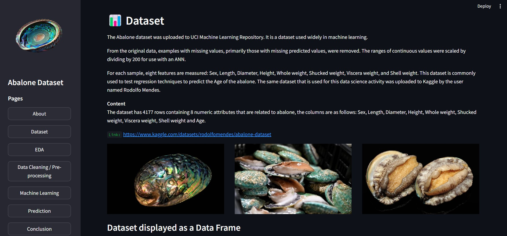

# Abalone Age Prediction Dashboard Using Streamlit

A Streamlit web application that performs **Exploratory Data Analysis (EDA)**, **Data Preprocessing**, and **Supervised Machine Learning** to predict the age of abalone from physical measurements using **Linear Regression**, **Random Forest Regressor** and **Support Vector Regression**.

### 🔗 Links:

- 🌐 [Streamlit Link](https://zeraphim-iris-classification-dashboard.streamlit.app/)
- 📗 [Google Colab Notebook](https://colab.research.google.com/drive/11jZ-5Eq3cjT9kt7EX_36JPg9EIEuK3QG?usp=sharing)

### 📊 Dataset:

- [Abalone Dataset (Kaggle)](https://www.kaggle.com/datasets/rodolfomendes/abalone-dataset)

### 👥👥 Members:

1. Kent Patrick **BOSTON**
2. Luis Frederick **CONDA**
3. Chaze Kyle **FIDELINO**
4. Joseph Isaac **ZAMORA**

### 📖 Pages:

1. `Dataset` - The Abalone Dataset contains information about abalone, including its sex, length, diameter, height, whole weight, shucked weight, viscera weight, shell weight, and rings.
2. `EDA` - Exploratory Data Analysis of the Abalone dataset. The analysis involved examining data both individually and in pairs. Histograms and pie charts were used to understand the distribution of numerical and categorical features, respectively. Pair plots and heatmaps were employed to visualize relationships and correlations between numerical features. Box plots were used to identify and potentially address outliers in the dataset.
3. `Data Cleaning / Pre-processing` - Data cleaning and pre-processing steps such as encoding the 'Sex' column and splitting the dataset into training and testing sets.
4. `Machine Learning` - Training three supervised ML models: Linear Regression, Random Forest Regressor and Support Vector Regression. Includes model evaluation, model prediction visualizations and feature importance.
5. `Prediction` - Prediction page where users can input values to predict the age of abalone using the trained models.
6. `Conclusion` - Summary of the insights and observations from the EDA and model training.

### 💡 Findings / Insights

Through exploratory data analysis and training of three regression models (`Linear Regression`, `Random Forest Regressor` and `Support Vector Regression`) on the **Abalone dataset**, the key insights and observations are:

#### 1. 📊 **Dataset Characteristics**:

- Univariate analysis showed that most features, such as **Height**, **Age**, and **Shucked Weight**, are positively skewed, while **Length** and **Diameter** exhibit negative skewness. Categorical analysis highlighted the distribution of **Sex**, with a notable prevalence of males.
- Bivariate analysis uncovered strong correlations between **Length**, **Diameter**, and **Whole Weight**, suggesting that larger abalones tend to weigh more. The correlation heatmap further emphasized that **Whole Weight** and **Shell Weight** are strongly linked with several other features.

#### 2. 🧼 **Cleaned Data**:

- The dataset was free of missing values, and the **Sex** column was encoded using LabelEncoder. Outliers were detected using the Interquartile Range (IQR) method, and several outliers were removed to ensure a more accurate analysis.
- The cleaned dataset was further refined by excluding the **Sex** column due to its weak correlation with other features. Finally, the data was split into training and testing sets, setting the stage for model training.

#### 3. 📈 **Model Performance (Linear Regression)**:

- The model explains about **50%** of the variance in the age of abalones, with **R-squared** values around **0.5** for both training and test sets. While it generalizes fairly well, the high **Mean Squared Error (MSE)** indicates that predictions may vary significantly from actual values.
- The scatter plot suggests a general linear trend, but with a noticeable spread in predictions, especially for test data.

#### 4. 📈 **Model Performance (Random Forest Regressor)**:

- This model captures most variance in the training data with a high **R-squared** value, indicating potential overfitting, as test **R-squared** values are considerably lower. The high test **MSE** and close test accuracy to `Linear Regression` suggest `Random Forest` may not improve prediction reliability over simpler models.
- **Shell weight** emerged as a key feature in predicting age, underscoring its significance in the dataset.

#### 5. 📈 **Model Performance (Support Vector Regression)**:

- The `SVR` model achieves moderate fit, explaining about **50%** of age variance, with similar **MSE** values to both `Linear Regression` and `Random Forest`.
- While the model follows the general trend of age prediction, significant scatter in higher actual ages indicates variability in predictions, with a residual plot showing that the model tends to underestimate the age of older abalones.

##### **Summing up:**        

Throughout this data science activity, the Abalone dataset provided valuable insights into predicting the age of abalones using three regression models: Linear Regression, Random Forest Regressor, and Support Vector Regression. Initial exploratory analysis highlighted the distribution and relationships among features, with key insights into their correlations. The dataset required minimal cleansing, as it was free of missing values, and preprocessing steps, such as encoding and outlier removal, prepared it for effective model training.

Each model demonstrated unique strengths and limitations: Linear Regression and SVR showed moderate fits, each explaining about 50% of the age variance, with noticeable error margins. Random Forest Regressor exhibited signs of overfitting, capturing high variance in training but less reliability on unseen data. Notably, Shell weight emerged as a significant predictor, underscoring its importance across models. In summary, while each model followed the general trend of age prediction, none achieved high precision for older abalones, revealing areas for potential model refinement.